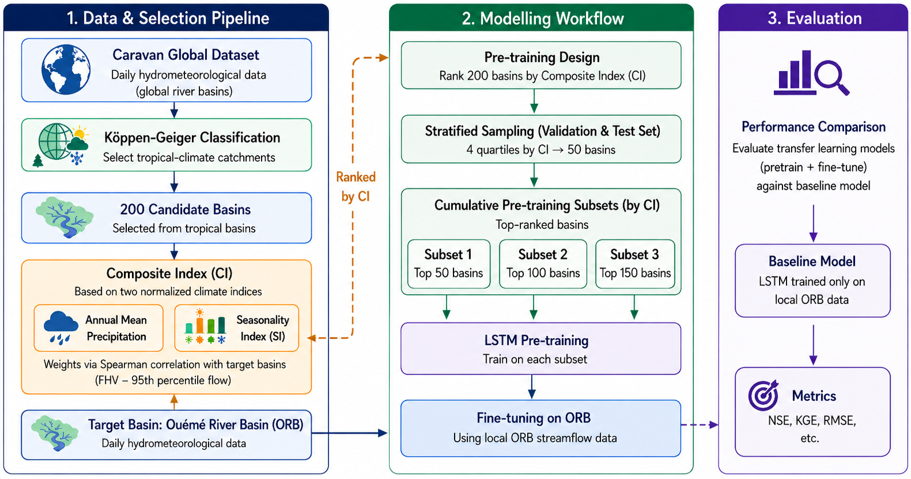

# Climate similarity-based transfer learning for streamflow prediction in the Ouémé River Basin

Code, model configurations, and results accompanying the manuscript:

**A climate similarity-based transfer learning framework using the global Caravan dataset for enhancing streamflow prediction in the Ouémé River Basin (Benin, West Africa)**

## Overview


This repository implements a transfer learning framework that leverages the global Caravan dataset to improve daily streamflow prediction in a data-scarce tropical basin. A composite climate similarity index is used to select and rank tropical donor catchments; LSTM models are pre-trained on cumulative donor subsets of increasing size and fine-tuned on local records, then compared with a model trained on Ouémé data alone.

### Workflow

- **Climate similarity index (CI)** — a composite index built from two normalized climate descriptors (annual mean precipitation and a seasonality index), with weights calibrated against the observed high-flow signature of the Ouémé at Bonou.
- **Donor selection** — tropical catchments are identified from Caravan using the Köppen-Geiger classification, ranked by CI, and grouped into three cumulative pre-training subsets (50, 100, and 150 basins).
- **Pre-training and fine-tuning** — an LSTM is pre-trained on each donor subset with `neuralhydrology` and fine-tuned on the five Ouémé stations.
- **Evaluation** — transfer configurations are benchmarked against a local-only baseline using KGE, NSE, Pearson r, and high-flow metrics over a fixed test period (2016–2020).

## Repository structure

```
.
├── configs/                    neuralhydrology YAML configurations
│   ├── LSTM_50C/                pre-training + fine-tuning configs, 50-basin subset
│   ├── LSTM_100C/               pre-training + fine-tuning configs, 100-basin subset
│   ├── LSTM_150C/               pre-training + fine-tuning configs, 150-basin subset
│   └── LSTM_Local/              local-only baseline configuration
├── notebooks/                  reproducible workflow
│   ├── 00_climate_similarity_index.ipynb
│   ├── 01_pretraining_finetuning.ipynb
│   ├── 02_pretraining_evaluation.ipynb
│   ├── 03_finetuning_evaluation.ipynb
│   └── 04_hydrogram_comparaison.ipynb
├── data/
│   ├── caravan_dataset/         donor catchment attributes/forcings (Caravan subset used)
│   ├── basin_lists/             donor subset lists (S50, S100, S150, hold-out)
│   └── local_basin_lists/       Ouémé station identifiers and metadata
├── Results/
│   ├── LSTM_50C/runs/
│   ├── LSTM_100C/runs/
│   ├── LSTM_150C/runs/
│   ├── LSTM_L/runs/              local-only baseline runs
│   └── Pre_trained_metrics/      performance metrics data from models
├── requirements.txt
├── CITATION.cff
├── LICENSE
└── README.md
```

## Data sources

| Dataset | Role | Access |
|---|---|---|
| Caravan (Kratzert et al., 2023) | Donor catchment attributes and forcings | https://github.com/kratzert/Caravan |
| ERA5-Land | Meteorological forcings (via Caravan) | https://cds.climate.copernicus.eu |
| Ouémé streamflow | Target observations, 5 stations | Direction Générale de l'Eau (Benin) — see note below |

Large raw datasets (Caravan, ERA5-Land) are not redistributed here; they are referenced by their original sources. Only the Ouémé-specific files and the donor basin lists produced in this study are included.

**Note on streamflow data.** Observed discharge for the five Ouémé stations was provided by the Direction Générale de l'Eau (Benin), and is available on reasonable request, subject to the data provider's conditions. *(À adapter selon l'accord final avec la DG-Eau, par ex. si une licence CC-BY-4.0 s'applique.)*

## Requirements

The workflow was developed and run on Google Colab with GPU acceleration.

```bash
pip install -r requirements.txt
```

Main dependencies: `neuralhydrology`, `torch`, `xarray`, `numpy`, `pandas`, `scipy`, `matplotlib`. Exact versions are pinned in `requirements.txt`.

## Reproducing the results

Run the notebooks in order:

1. `00_climate_similarity_index.ipynb` — computes the CI for the tropical catchments and reproduces the index validation figures.
2. `01_pretraining_finetuning.ipynb` — pre-trains and fine-tunes the LSTM models using the configurations in `configs/`.
3. `02_pretraining_evaluation.ipynb` — evaluates the pre-trained (donor-only) models.
4. `03_finetuning_evaluation.ipynb` — evaluates the fine-tuned models against the local-only baseline.
5. `04_hydrogram_comparaison.ipynb` — generates hydrograph comparison figures.

Trained models can be regenerated from the provided configurations and input data; model checkpoints are not archived in this repository to keep it lightweight.

## Citation

If you use this repository, please cite both the manuscript and this archived release:

```bibtex
@software{oueme_transfer_learning_2026,
  author    = {Ahouandjinou, Jérôme Enagnon, Aymar Yaovi Bossa, Jean Hounkpe, Riccardo Taormina},
  title     = {A climate similarity-based transfer learning framework using the global Caravan dataset for enhancing streamflow prediction in the Ouémé River Basin (Benin, West Africa)},
  year      = {2026},
  publisher = {Zenodo},
  doi       = {10.5281/zenodo.21813084},
  url       = {https://doi.org/10.5281/zenodo.21813084}
}
```

## License

This project is licensed under the MIT License — see [LICENSE](LICENSE) for details.
